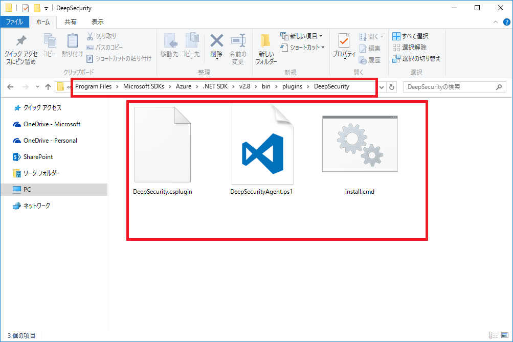
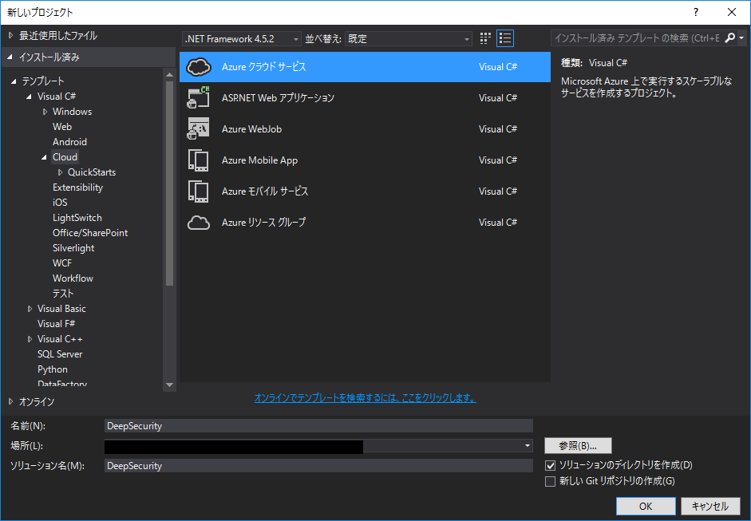
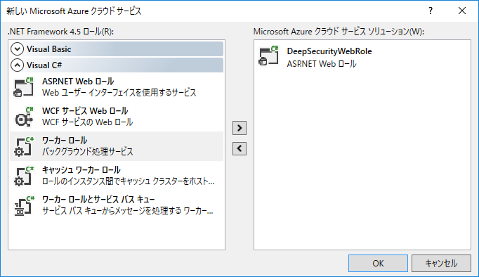
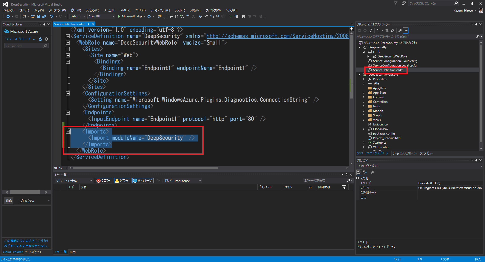
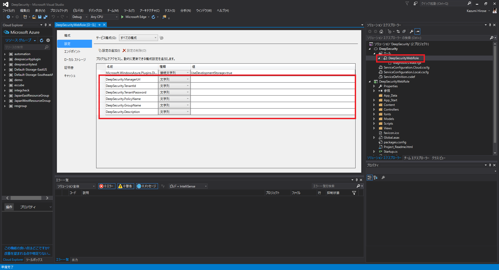
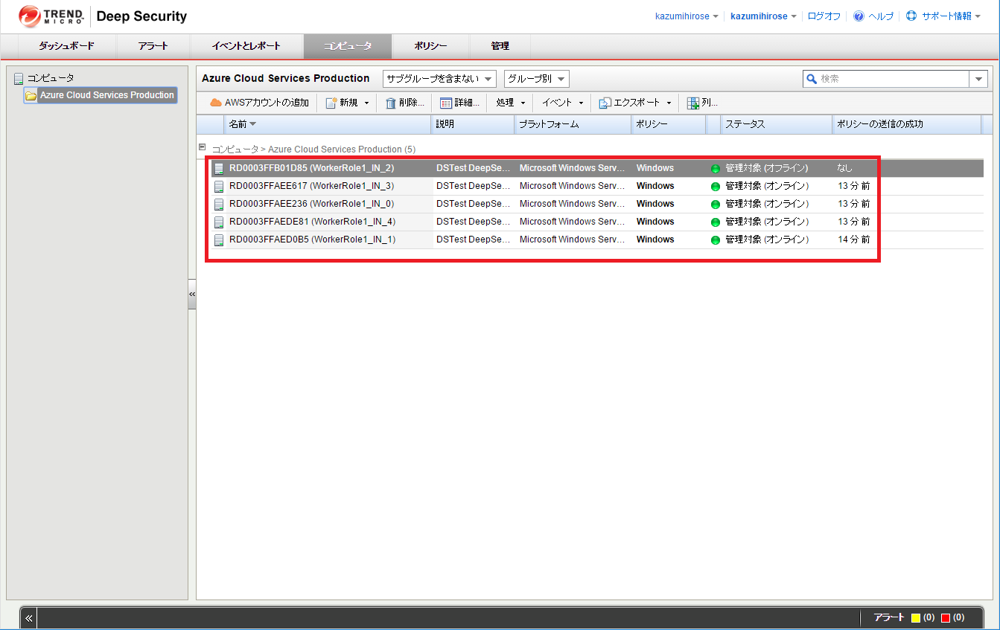
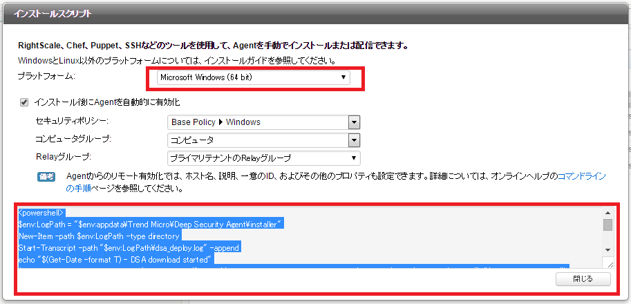

# Trend Micro Deep Security agent install plugin for Azure CloudServices

Microsoft Azureが提供しているクラウドサービス(CloudServices）に、Trend Micro Deep Securityのエージェントを自動インストールを行い、指定のマネージャーに自動登録を行います。
Trend Micro Deep SecurityのSaaSクラウドである、[Trend Micro Deep Security as a Service](https://www.trendmicro.co.jp/jp/business/products/tmdsaas/)で簡単な動作の確認を行っています。

Azure CloudServicesに用いるGuest OSは、PCI DSS に準拠しており、セキュアな運用が可能ですが、組み合わせる事でより便利な機能を提供できるようになります。
Trend Micro Deep Securityは以下の特徴を持つ製品です。
- IDS/IPSによる侵入防御
- ファイアウォールによるフィルタリング
- 不正プログラム対策
- Webレピューテーションによる不正サイト接続のブロック
- ファイルやレジストリの変更監視
- セキュリティログ監視

## プラグインの準備

1. ダウンロード後ZIPを展開してください。
1. Azure SDK .NETのpluginsディレクトリに配置してください。例えば、Azure SDK 2.8 for .NETでは、以下のディレクトリとなります。
C:\Program Files\Microsoft SDKs\Azure\.NET SDK\v2.8\bin\plugins
1. DeepSecurityというフォルダに展開してください。



## プラグインの使い方

1. Visual Studioから、クラウドサービスのソリューションを作成してください、どのRoleでも対応します。

1. ServiceDefinition.csdefにプラグインのimportを追加してください。

```
<?xml version="1.0" encoding="utf-8"?>
<ServiceDefinition name="DeepSecurity" xmlns="http://schemas.microsoft.com/ServiceHosting/2008/10/ServiceDefinition" schemaVersion="2015-04.2.6">
  <WebRole name="DeepSecurityWebRole" vmsize="Small">
    <Sites>
      <Site name="Web">
        <Bindings>
          <Binding name="Endpoint1" endpointName="Endpoint1" />
        </Bindings>
      </Site>
    </Sites>
    <ConfigurationSettings>
      <Setting name="Microsoft.WindowsAzure.Plugins.Diagnostics.ConnectionString" />
    </ConfigurationSettings>
    <Endpoints>
      <InputEndpoint name="Endpoint1" protocol="http" port="80" />
    </Endpoints>
    <!-- 以下を追記します -->
    <Imports>
      <Import moduleName="DeepSecurity" />
    </Imports>
    <!-- ここまで追記します -->
  </WebRole>
</ServiceDefinition>
```
1. 追加した後にロールの構成から設定を開いてください。

1. 設定例を参考に設定を行ってください。
1. 設定完了後、デプロイを行うと自動でTrend Micro Deep Securityエージェントインストールされた後、管理対象としてマネージャー画面に表示されます。


## プラグイン設定の情報取得について

DeepSecurity.ManagerUrl/DeepSecurity.TenantId/DeepSecurity.TenantPasswordなどの情報は、Trend Micro Deep Security as a Serviceにログインした右上のサポート情報/インストールスクリプトから情報を得られます。


## プラグイン設定の方法

| 設定項目 | 説明 | 設定例 |
| ------------- |-------------|-------------|
| DeepSecurity.ManagerUrl| Deep SecurityのマネージャーURL | dsm://agents.deepsecurity.trendmicro.com:443/ |
| DeepSecurity.TenantId | dsmに登録する際に用いるTenantId | XXXXXXXX-XXXX-XXXX-XXXX-XXXXXXXXXXXX |
| DeepSecurity.TenantPassword | dsmに登録する際に用いるTenantPassword | XXXXXXXX-XXXX-XXXX-XXXX-XXXXXXXXXXX |
| DeepSecurity.PolicyName | 適用するポリシー名 | Windows |
| DeepSecurity.GroupName | マネージャーのグループ名、無い場合は自動で作られます | Azure cloud Service Production |
| DeepSecurity.Description | ホスト概要 | 任意の文字列 |

